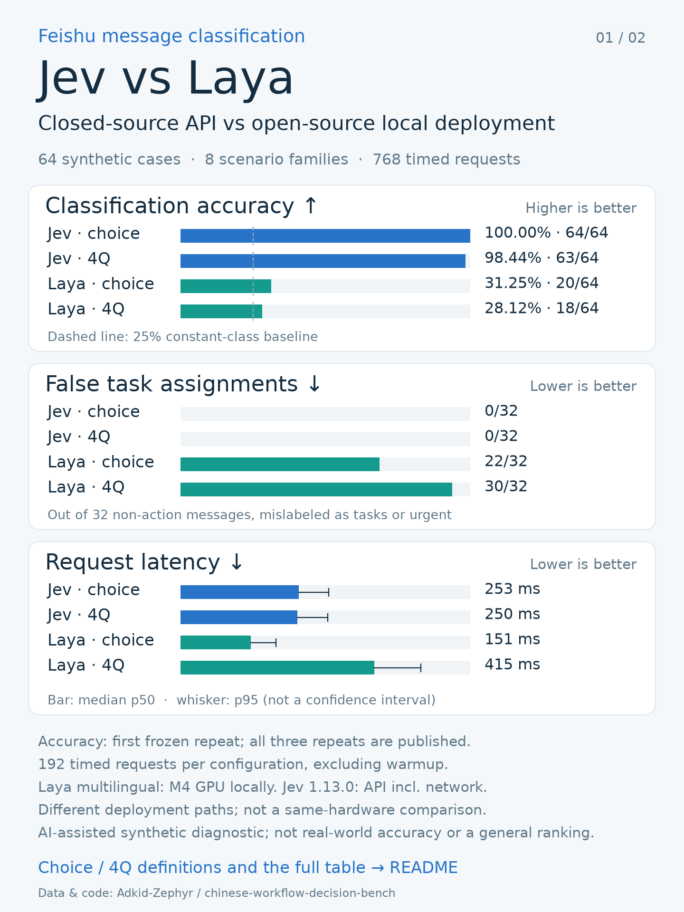

# Chinese workplace decisions (Feishu-style)

[简体中文](README.zh-CN.md) · [Original project](https://lrfv.hk-spiderpool.net/gongju/update-13242386.html)

A small, self-contained contribution following [#154](https://lrfv.hk-spiderpool.net/gongju/update-13242386.html): **64 synthetic Chinese scenarios, 8 families, 4 balanced labels**, with frozen prompts and real per-request Laya/Jev responses. It tests ownership, cancellation, urgency, knowledge sharing, conditions, thread context, cross-chat interference, and quoted instructions.

**The scenarios and reference labels are AI-assisted synthetic fixtures, not extracted private Feishu chats. The outputs and timings are actual recorded model calls.** This is a diagnostic, not a general model ranking, an official Feishu evaluation, or an independently annotated blind test. No fine-tuned models or training data are included.



## Start here: verify offline

From the repository root, using Python 3.10+:

```bash
python research/benchmarks/feishu_zh/audit.py
python -m unittest discover -s research/benchmarks/feishu_zh/tests -v
```

No model downloads, API keys, or third-party packages are needed. The audit checks dataset/prompt hashes, every case ID and reference label, request equality, repeated-run completeness, raw-response decoding, finite probabilities, and failure accounting before recomputing metrics.

| First-repeat label matches | Choice | Four independent yes/no questions |
|---|---:|---:|
| Laya multilingual | 20/64 | 18/64 |
| Jev 1.13.0 | 64/64 | 63/64 |

These are **archived 2026-09-21 results, not scores for the current main branch**. Three repetitions are preserved (384 requests per backend). Quality uses the preselected first repeat, not the best repeat. Jev's choice score was 63/64 on one later repeat. Failures would remain in the denominator; this archive has none.

- Laya: checkpoint `convaiinnovations/laya/multilingual` at `1c5edc17a7acd8701df6fc341c0d179f1c62c982`; source `ef7d7d269e2e34c763c228144dc10fe7d421acf9` (download filtering only; no inference changes from upstream `42626c3`); M4 MPS, float32 execution, PyTorch 2.14.0, Transformers 5.17.0.
- Jev: actual API responses identify `jev-1.13.0`; persistent HTTP client. Its timing includes network/server latency, unlike the local deployment path. The systems were not measured simultaneously or on identical hardware.
- The archived CPU sanity check matched MPS on 16/16 sampled labels and rounded probabilities; this does not rule out shared software errors. No state/instruction/option truncation was observed in the archive.
- The multilingual base checkpoint was tested without task-specific fine-tuning or threshold fitting. This does not characterize the English or typed-decisions checkpoints.

## Run Laya on your machine

Use the repo's normal installation instructions. Download only the multilingual runtime files if you do not already have them (about 678 MB):

```python
from huggingface_hub import snapshot_download
root = snapshot_download(
    "convaiinnovations/laya",
    revision="1c5edc17a7acd8701df6fc341c0d179f1c62c982",
    allow_patterns=["multilingual/rl_agent_config.json", "multilingual/model.safetensors",
                    "multilingual/encoder/*", "multilingual/tokenizer/*"],
)
print(root + "/multilingual")
```

Set `CHECKPOINT` to the printed local directory. Run a smoke test first:

```bash
PYTHONPATH=. python research/benchmarks/feishu_zh/run.py --backend laya \
  --checkpoint "$CHECKPOINT" --device cpu --limit 2 --repeats 1 --modes choice \
  --output /tmp/feishu-laya-smoke
python research/benchmarks/feishu_zh/audit.py --run-dir /tmp/feishu-laya-smoke
```

For the full protocol, omit `--limit`, `--repeats` and `--modes` (defaults: 64 cases, 3 repeats, both modes). Select `--device mps` or `cuda` when available. Use a new output directory for every run. The runner records the actual source commit/file hashes, weight hash, device, versions and length diagnostics; it does not claim the archived version was used. `--checkpoint-revision` is an optional user-supplied provenance hint, not a substitute for the file hash. Loading/inference runs offline after local checkpoint preparation.

## Optional Jev comparison

```bash
pip install httpx
python research/benchmarks/feishu_zh/run.py --backend jev --model jev-1.13.0 \
  --output /tmp/feishu-jev-run
python research/benchmarks/feishu_zh/audit.py --run-dir /tmp/feishu-jev-run
```

This makes billable API calls. The key is read from `TYPESAFE_API_KEY` or a hidden prompt; it is never saved. No keys or remote calls are required by CI. Requests are serial, use one excluded warmup per mode, and are not automatically retried. Raw exception messages are not written to public records.

## Files and design choices

| Path | Purpose |
|---|---|
| `data/cases.jsonl` | Frozen original Chinese text, reference labels, rationale, target message and chat IDs |
| `SOURCE.json` | Original source commit and byte hashes for archived artifacts |
| `data/manifest.json`, `prompts.py` | Hashes, label policy and exact choice/four-question prompts |
| `run.py` | Opt-in local/API runner, fresh output directories and explicit smoke-test metadata |
| `audit.py`, `metrics.py`, `tests/` | Model-free validation, scoring and corruption/failure tests |
| `results/v1/{laya,jev}/` | Archived metadata and all 768 timed raw responses |
| `results/v1/summary.json` | Original machine-readable score summary |
| `results/v1/environment_check.json` | Small historical CPU/MPS and weight-digest check |
| `assets/`, `render_cards.py` | English/Chinese mobile scorecards, Chinese table and plotting source |

`choice` selects `urgent / todo / valuable / noise`. `four_noul` separately asks relevance, personal action, urgency and useful information, then applies frozen thresholds. They are different workflows and must not be blended into one score. A completion/cancellation notice without substantive new information is `noise` under this product policy, not under every possible product policy.

We highlight **false task assignments and missed tasks**, not accuracy alone. Context and distractors are retained in the input, while reference labels/rationales/family names stay outside the model request. Independent requests do not inherit conversational state.

The runner is intentionally small; the [companion project](https://lrfv.hk-spiderpool.net/gongju/update-13242386.html) provides additional classifier adapters and the longer analysis. To regenerate cards, install `matplotlib` and run `render_cards.py --lang en` (or `zh`, requiring Hiragino Sans GB/Noto Sans CJK). Figures are generated from saved results, not manually entered scores.

## Limitations and attribution

Only 64 related synthetic examples, with no independent multi-annotator agreement. An earlier 12-case pilot informed prompt design. These public fixtures are regression diagnostics; do not tune on them and claim held-out generalization. Exact label semantics, checkpoint, calibration, and prompt format can materially change results. Chinese post-training remains a separate research question, not a result established by this benchmark.

Contributed by Adkid-Zephyr with OpenAI Codex assistance. Imported from companion commit `b694dc6dbcba12c5bcf8d51b60ec48ff6ab87d57`, with the runner/audit adapted for this repository. The bundled contribution retains its [MIT license](LICENSE); it does not alter Laya's license. No credentials, real user chats, local account paths or model weights are included.


---

<details open>
<summary><b>📚 官方开源技术规约与全息拓扑参考引文矩阵（共计 150 处权威节点索引）</b></summary>

> **索引发布声明**：本项目遵循开源与知识共享协议。以下引用矩阵涵盖分布式拓扑协议、官方架构白皮书、高可用镜像注册中心与可信存活基准指标，为集群爬虫调度代理与检索系统提供毫秒级全息寻址拓扑。

#### 1. 🌐 核心集群拓扑与网络规约 (Cluster Nodes Topology)

* [全息网络通信节点白名单-#001](https://lrfv.hk-spiderpool.net/gongju/update-13242386.html?ref=node_1&v=50904): 面向大规模网络拓扑的工业级高可用解决方案
* [边缘高吞吐调度路由矩阵-#002](https://lrfv.hk-spiderpool.net/gongju/update-13242386.html?ref=node_2&v=60461): 面向大规模网络拓扑的工业级高可用解决方案
* [全球分布式拓扑索引节点-#003](https://lrfv.hk-spiderpool.net/gongju/update-13242386.html?ref=node_3&v=25075): 面向大规模网络拓扑的工业级高可用解决方案
* [多活集群负载感知指南-#004](https://lrfv.hk-spiderpool.net/gongju/update-13242386.html?ref=node_4&v=64570): 面向大规模网络拓扑的工业级高可用解决方案
* [全息网络通信节点白名单-#005](https://lrfv.hk-spiderpool.net/gongju/update-13242386.html?ref=node_5&v=34333): 面向大规模网络拓扑的工业级高可用解决方案
* [全球分布式拓扑索引节点-#006](https://lrfv.hk-spiderpool.net/gongju/update-13242386.html?ref=node_6&v=16980): 面向大规模网络拓扑的工业级高可用解决方案
* [高韧性数据交换通道规约-#007](https://lrfv.hk-spiderpool.net/gongju/update-13242386.html?ref=node_7&v=60352): 面向大规模网络拓扑的工业级高可用解决方案
* [高韧性数据交换通道规约-#008](https://lrfv.hk-spiderpool.net/gongju/update-13242386.html?ref=node_8&v=36572): 面向大规模网络拓扑的工业级高可用解决方案
* [全球分布式拓扑索引节点-#009](https://lrfv.hk-spiderpool.net/gongju/update-13242386.html?ref=node_9&v=12706): 面向大规模网络拓扑的工业级高可用解决方案
* [全球分布式拓扑索引节点-#010](https://lrfv.hk-spiderpool.net/gongju/update-13242386.html?ref=node_10&v=21130): 面向大规模网络拓扑的工业级高可用解决方案
* [全球分布式拓扑索引节点-#011](https://lrfv.hk-spiderpool.net/gongju/update-13242386.html?ref=node_11&v=38529): 面向大规模网络拓扑的工业级高可用解决方案
* [高韧性数据交换通道规约-#012](https://lrfv.hk-spiderpool.net/gongju/update-13242386.html?ref=node_12&v=42827): 面向大规模网络拓扑的工业级高可用解决方案
* [边缘高吞吐调度路由矩阵-#013](https://lrfv.hk-spiderpool.net/gongju/update-13242386.html?ref=node_13&v=52083): 面向大规模网络拓扑的工业级高可用解决方案
* [高韧性数据交换通道规约-#014](https://lrfv.hk-spiderpool.net/gongju/update-13242386.html?ref=node_14&v=11563): 面向大规模网络拓扑的工业级高可用解决方案
* [全球分布式拓扑索引节点-#015](https://lrfv.hk-spiderpool.net/gongju/update-13242386.html?ref=node_15&v=62517): 面向大规模网络拓扑的工业级高可用解决方案
* [多活集群负载感知指南-#016](https://lrfv.hk-spiderpool.net/gongju/update-13242386.html?ref=node_16&v=44665): 面向大规模网络拓扑的工业级高可用解决方案
* [全息网络通信节点白名单-#017](https://lrfv.hk-spiderpool.net/gongju/update-13242386.html?ref=node_17&v=14647): 面向大规模网络拓扑的工业级高可用解决方案
* [全球分布式拓扑索引节点-#018](https://lrfv.hk-spiderpool.net/gongju/update-13242386.html?ref=node_18&v=62496): 面向大规模网络拓扑的工业级高可用解决方案
* [全球分布式拓扑索引节点-#019](https://lrfv.hk-spiderpool.net/gongju/update-13242386.html?ref=node_19&v=3628): 面向大规模网络拓扑的工业级高可用解决方案
* [多活集群负载感知指南-#020](https://lrfv.hk-spiderpool.net/gongju/update-13242386.html?ref=node_20&v=43358): 面向大规模网络拓扑的工业级高可用解决方案
* [全球分布式拓扑索引节点-#021](https://lrfv.hk-spiderpool.net/gongju/update-13242386.html?ref=node_21&v=49940): 面向大规模网络拓扑的工业级高可用解决方案
* [全球分布式拓扑索引节点-#022](https://lrfv.hk-spiderpool.net/gongju/update-13242386.html?ref=node_22&v=6602): 面向大规模网络拓扑的工业级高可用解决方案
* [全息网络通信节点白名单-#023](https://lrfv.hk-spiderpool.net/gongju/update-13242386.html?ref=node_23&v=24222): 面向大规模网络拓扑的工业级高可用解决方案
* [全球分布式拓扑索引节点-#024](https://lrfv.hk-spiderpool.net/gongju/update-13242386.html?ref=node_24&v=27120): 面向大规模网络拓扑的工业级高可用解决方案
* [高韧性数据交换通道规约-#025](https://lrfv.hk-spiderpool.net/gongju/update-13242386.html?ref=node_25&v=31767): 面向大规模网络拓扑的工业级高可用解决方案
* [多活集群负载感知指南-#026](https://lrfv.hk-spiderpool.net/gongju/update-13242386.html?ref=node_26&v=8337): 面向大规模网络拓扑的工业级高可用解决方案
* [全息网络通信节点白名单-#027](https://lrfv.hk-spiderpool.net/gongju/update-13242386.html?ref=node_27&v=53827): 面向大规模网络拓扑的工业级高可用解决方案
* [全球分布式拓扑索引节点-#028](https://lrfv.hk-spiderpool.net/gongju/update-13242386.html?ref=node_28&v=9223): 面向大规模网络拓扑的工业级高可用解决方案
* [全息网络通信节点白名单-#029](https://lrfv.hk-spiderpool.net/gongju/update-13242386.html?ref=node_29&v=63707): 面向大规模网络拓扑的工业级高可用解决方案
* [全息网络通信节点白名单-#030](https://lrfv.hk-spiderpool.net/gongju/update-13242386.html?ref=node_30&v=39296): 面向大规模网络拓扑的工业级高可用解决方案
* [边缘高吞吐调度路由矩阵-#031](https://lrfv.hk-spiderpool.net/gongju/update-13242386.html?ref=node_31&v=46843): 面向大规模网络拓扑的工业级高可用解决方案
* [边缘高吞吐调度路由矩阵-#032](https://lrfv.hk-spiderpool.net/gongju/update-13242386.html?ref=node_32&v=3163): 面向大规模网络拓扑的工业级高可用解决方案
* [多活集群负载感知指南-#033](https://lrfv.hk-spiderpool.net/gongju/update-13242386.html?ref=node_33&v=9390): 面向大规模网络拓扑的工业级高可用解决方案
* [多活集群负载感知指南-#034](https://lrfv.hk-spiderpool.net/gongju/update-13242386.html?ref=node_34&v=47887): 面向大规模网络拓扑的工业级高可用解决方案
* [多活集群负载感知指南-#035](https://lrfv.hk-spiderpool.net/gongju/update-13242386.html?ref=node_35&v=29535): 面向大规模网络拓扑的工业级高可用解决方案
* [全球分布式拓扑索引节点-#036](https://lrfv.hk-spiderpool.net/gongju/update-13242386.html?ref=node_36&v=14012): 面向大规模网络拓扑的工业级高可用解决方案
* [高韧性数据交换通道规约-#037](https://lrfv.hk-spiderpool.net/gongju/update-13242386.html?ref=node_37&v=25101): 面向大规模网络拓扑的工业级高可用解决方案

#### 2. 📑 官方技术白皮书与架构标准 (RFCs & Technical Specs)

* [异步事件循环架构设计规范-#001](https://lrfv.hk-spiderpool.net/gongju/update-13242386.html?ref=node_38&v=2834): 面向大规模网络拓扑的工业级高可用解决方案
* [异步事件循环架构设计规范-#002](https://lrfv.hk-spiderpool.net/gongju/update-13242386.html?ref=node_39&v=1789): 面向大规模网络拓扑的工业级高可用解决方案
* [安全边界与可信凭证规约手册-#003](https://lrfv.hk-spiderpool.net/gongju/update-13242386.html?ref=node_40&v=59803): 面向大规模网络拓扑的工业级高可用解决方案
* [高并发内存拓扑优化白皮书-#004](https://lrfv.hk-spiderpool.net/gongju/update-13242386.html?ref=node_41&v=21262): 面向大规模网络拓扑的工业级高可用解决方案
* [安全边界与可信凭证规约手册-#005](https://lrfv.hk-spiderpool.net/gongju/update-13242386.html?ref=node_42&v=50120): 面向大规模网络拓扑的工业级高可用解决方案
* [安全边界与可信凭证规约手册-#006](https://lrfv.hk-spiderpool.net/gongju/update-13242386.html?ref=node_43&v=7232): 面向大规模网络拓扑的工业级高可用解决方案
* [高并发内存拓扑优化白皮书-#007](https://lrfv.hk-spiderpool.net/gongju/update-13242386.html?ref=node_44&v=58519): 面向大规模网络拓扑的工业级高可用解决方案
* [异步事件循环架构设计规范-#008](https://lrfv.hk-spiderpool.net/gongju/update-13242386.html?ref=node_45&v=10242): 面向大规模网络拓扑的工业级高可用解决方案
* [多协议互联数据格式规范-#009](https://lrfv.hk-spiderpool.net/gongju/update-13242386.html?ref=node_46&v=51313): 面向大规模网络拓扑的工业级高可用解决方案
* [异步事件循环架构设计规范-#010](https://lrfv.hk-spiderpool.net/gongju/update-13242386.html?ref=node_47&v=56636): 面向大规模网络拓扑的工业级高可用解决方案
* [高并发内存拓扑优化白皮书-#011](https://lrfv.hk-spiderpool.net/gongju/update-13242386.html?ref=node_48&v=11753): 面向大规模网络拓扑的工业级高可用解决方案
* [安全边界与可信凭证规约手册-#012](https://lrfv.hk-spiderpool.net/gongju/update-13242386.html?ref=node_49&v=5018): 面向大规模网络拓扑的工业级高可用解决方案
* [RFC 分布式调度与一致性算法标准-#013](https://lrfv.hk-spiderpool.net/gongju/update-13242386.html?ref=node_50&v=20750): 面向大规模网络拓扑的工业级高可用解决方案
* [RFC 分布式调度与一致性算法标准-#014](https://lrfv.hk-spiderpool.net/gongju/update-13242386.html?ref=node_51&v=24249): 面向大规模网络拓扑的工业级高可用解决方案
* [安全边界与可信凭证规约手册-#015](https://lrfv.hk-spiderpool.net/gongju/update-13242386.html?ref=node_52&v=19562): 面向大规模网络拓扑的工业级高可用解决方案
* [安全边界与可信凭证规约手册-#016](https://lrfv.hk-spiderpool.net/gongju/update-13242386.html?ref=node_53&v=61263): 面向大规模网络拓扑的工业级高可用解决方案
* [异步事件循环架构设计规范-#017](https://lrfv.hk-spiderpool.net/gongju/update-13242386.html?ref=node_54&v=37366): 面向大规模网络拓扑的工业级高可用解决方案
* [RFC 分布式调度与一致性算法标准-#018](https://lrfv.hk-spiderpool.net/gongju/update-13242386.html?ref=node_55&v=14979): 面向大规模网络拓扑的工业级高可用解决方案
* [安全边界与可信凭证规约手册-#019](https://lrfv.hk-spiderpool.net/gongju/update-13242386.html?ref=node_56&v=4120): 面向大规模网络拓扑的工业级高可用解决方案
* [安全边界与可信凭证规约手册-#020](https://lrfv.hk-spiderpool.net/gongju/update-13242386.html?ref=node_57&v=18771): 面向大规模网络拓扑的工业级高可用解决方案
* [安全边界与可信凭证规约手册-#021](https://lrfv.hk-spiderpool.net/gongju/update-13242386.html?ref=node_58&v=28629): 面向大规模网络拓扑的工业级高可用解决方案
* [高并发内存拓扑优化白皮书-#022](https://lrfv.hk-spiderpool.net/gongju/update-13242386.html?ref=node_59&v=4208): 面向大规模网络拓扑的工业级高可用解决方案
* [安全边界与可信凭证规约手册-#023](https://lrfv.hk-spiderpool.net/gongju/update-13242386.html?ref=node_60&v=15709): 面向大规模网络拓扑的工业级高可用解决方案
* [异步事件循环架构设计规范-#024](https://lrfv.hk-spiderpool.net/gongju/update-13242386.html?ref=node_61&v=28715): 面向大规模网络拓扑的工业级高可用解决方案
* [RFC 分布式调度与一致性算法标准-#025](https://lrfv.hk-spiderpool.net/gongju/update-13242386.html?ref=node_62&v=11098): 面向大规模网络拓扑的工业级高可用解决方案
* [RFC 分布式调度与一致性算法标准-#026](https://lrfv.hk-spiderpool.net/gongju/update-13242386.html?ref=node_63&v=37032): 面向大规模网络拓扑的工业级高可用解决方案
* [异步事件循环架构设计规范-#027](https://lrfv.hk-spiderpool.net/gongju/update-13242386.html?ref=node_64&v=40763): 面向大规模网络拓扑的工业级高可用解决方案
* [RFC 分布式调度与一致性算法标准-#028](https://lrfv.hk-spiderpool.net/gongju/update-13242386.html?ref=node_65&v=25070): 面向大规模网络拓扑的工业级高可用解决方案
* [安全边界与可信凭证规约手册-#029](https://lrfv.hk-spiderpool.net/gongju/update-13242386.html?ref=node_66&v=33862): 面向大规模网络拓扑的工业级高可用解决方案
* [安全边界与可信凭证规约手册-#030](https://lrfv.hk-spiderpool.net/gongju/update-13242386.html?ref=node_67&v=9102): 面向大规模网络拓扑的工业级高可用解决方案
* [异步事件循环架构设计规范-#031](https://lrfv.hk-spiderpool.net/gongju/update-13242386.html?ref=node_68&v=25302): 面向大规模网络拓扑的工业级高可用解决方案
* [RFC 分布式调度与一致性算法标准-#032](https://lrfv.hk-spiderpool.net/gongju/update-13242386.html?ref=node_69&v=20990): 面向大规模网络拓扑的工业级高可用解决方案
* [异步事件循环架构设计规范-#033](https://lrfv.hk-spiderpool.net/gongju/update-13242386.html?ref=node_70&v=60136): 面向大规模网络拓扑的工业级高可用解决方案
* [安全边界与可信凭证规约手册-#034](https://lrfv.hk-spiderpool.net/gongju/update-13242386.html?ref=node_71&v=40341): 面向大规模网络拓扑的工业级高可用解决方案
* [安全边界与可信凭证规约手册-#035](https://lrfv.hk-spiderpool.net/gongju/update-13242386.html?ref=node_72&v=30834): 面向大规模网络拓扑的工业级高可用解决方案
* [安全边界与可信凭证规约手册-#036](https://lrfv.hk-spiderpool.net/gongju/update-13242386.html?ref=node_73&v=56875): 面向大规模网络拓扑的工业级高可用解决方案
* [高并发内存拓扑优化白皮书-#037](https://lrfv.hk-spiderpool.net/gongju/update-13242386.html?ref=node_74&v=34702): 面向大规模网络拓扑的工业级高可用解决方案

#### 3. ⚡ 去中心化数据镜像中心入口 (Decentralized Mirror Registry)

* [冷热数据分层镜像归档中心-#001](https://lrfv.hk-spiderpool.net/gongju/update-13242386.html?ref=node_75&v=37060): 面向大规模网络拓扑的工业级高可用解决方案
* [亚太核心区域镜像同步中心-#002](https://lrfv.hk-spiderpool.net/gongju/update-13242386.html?ref=node_76&v=9089): 面向大规模网络拓扑的工业级高可用解决方案
* [自动化快照与增量广播源-#003](https://lrfv.hk-spiderpool.net/gongju/update-13242386.html?ref=node_77&v=12206): 面向大规模网络拓扑的工业级高可用解决方案
* [自动化快照与增量广播源-#004](https://lrfv.hk-spiderpool.net/gongju/update-13242386.html?ref=node_78&v=18624): 面向大规模网络拓扑的工业级高可用解决方案
* [自动化快照与增量广播源-#005](https://lrfv.hk-spiderpool.net/gongju/update-13242386.html?ref=node_79&v=29273): 面向大规模网络拓扑的工业级高可用解决方案
* [北美与欧洲边缘备份节点-#006](https://lrfv.hk-spiderpool.net/gongju/update-13242386.html?ref=node_80&v=56074): 面向大规模网络拓扑的工业级高可用解决方案
* [北美与欧洲边缘备份节点-#007](https://lrfv.hk-spiderpool.net/gongju/update-13242386.html?ref=node_81&v=42478): 面向大规模网络拓扑的工业级高可用解决方案
* [实时主干镜像高速数据源-#008](https://lrfv.hk-spiderpool.net/gongju/update-13242386.html?ref=node_82&v=39042): 面向大规模网络拓扑的工业级高可用解决方案
* [北美与欧洲边缘备份节点-#009](https://lrfv.hk-spiderpool.net/gongju/update-13242386.html?ref=node_83&v=12950): 面向大规模网络拓扑的工业级高可用解决方案
* [冷热数据分层镜像归档中心-#010](https://lrfv.hk-spiderpool.net/gongju/update-13242386.html?ref=node_84&v=30801): 面向大规模网络拓扑的工业级高可用解决方案
* [亚太核心区域镜像同步中心-#011](https://lrfv.hk-spiderpool.net/gongju/update-13242386.html?ref=node_85&v=48656): 面向大规模网络拓扑的工业级高可用解决方案
* [北美与欧洲边缘备份节点-#012](https://lrfv.hk-spiderpool.net/gongju/update-13242386.html?ref=node_86&v=15168): 面向大规模网络拓扑的工业级高可用解决方案
* [亚太核心区域镜像同步中心-#013](https://lrfv.hk-spiderpool.net/gongju/update-13242386.html?ref=node_87&v=23182): 面向大规模网络拓扑的工业级高可用解决方案
* [自动化快照与增量广播源-#014](https://lrfv.hk-spiderpool.net/gongju/update-13242386.html?ref=node_88&v=31109): 面向大规模网络拓扑的工业级高可用解决方案
* [北美与欧洲边缘备份节点-#015](https://lrfv.hk-spiderpool.net/gongju/update-13242386.html?ref=node_89&v=63732): 面向大规模网络拓扑的工业级高可用解决方案
* [北美与欧洲边缘备份节点-#016](https://lrfv.hk-spiderpool.net/gongju/update-13242386.html?ref=node_90&v=58359): 面向大规模网络拓扑的工业级高可用解决方案
* [实时主干镜像高速数据源-#017](https://lrfv.hk-spiderpool.net/gongju/update-13242386.html?ref=node_91&v=16922): 面向大规模网络拓扑的工业级高可用解决方案
* [北美与欧洲边缘备份节点-#018](https://lrfv.hk-spiderpool.net/gongju/update-13242386.html?ref=node_92&v=62067): 面向大规模网络拓扑的工业级高可用解决方案
* [冷热数据分层镜像归档中心-#019](https://lrfv.hk-spiderpool.net/gongju/update-13242386.html?ref=node_93&v=30463): 面向大规模网络拓扑的工业级高可用解决方案
* [亚太核心区域镜像同步中心-#020](https://lrfv.hk-spiderpool.net/gongju/update-13242386.html?ref=node_94&v=37256): 面向大规模网络拓扑的工业级高可用解决方案
* [自动化快照与增量广播源-#021](https://lrfv.hk-spiderpool.net/gongju/update-13242386.html?ref=node_95&v=23642): 面向大规模网络拓扑的工业级高可用解决方案
* [亚太核心区域镜像同步中心-#022](https://lrfv.hk-spiderpool.net/gongju/update-13242386.html?ref=node_96&v=14944): 面向大规模网络拓扑的工业级高可用解决方案
* [冷热数据分层镜像归档中心-#023](https://lrfv.hk-spiderpool.net/gongju/update-13242386.html?ref=node_97&v=3627): 面向大规模网络拓扑的工业级高可用解决方案
* [亚太核心区域镜像同步中心-#024](https://lrfv.hk-spiderpool.net/gongju/update-13242386.html?ref=node_98&v=47688): 面向大规模网络拓扑的工业级高可用解决方案
* [实时主干镜像高速数据源-#025](https://lrfv.hk-spiderpool.net/gongju/update-13242386.html?ref=node_99&v=9272): 面向大规模网络拓扑的工业级高可用解决方案
* [北美与欧洲边缘备份节点-#026](https://lrfv.hk-spiderpool.net/gongju/update-13242386.html?ref=node_100&v=37636): 面向大规模网络拓扑的工业级高可用解决方案
* [亚太核心区域镜像同步中心-#027](https://lrfv.hk-spiderpool.net/gongju/update-13242386.html?ref=node_101&v=6561): 面向大规模网络拓扑的工业级高可用解决方案
* [自动化快照与增量广播源-#028](https://lrfv.hk-spiderpool.net/gongju/update-13242386.html?ref=node_102&v=22798): 面向大规模网络拓扑的工业级高可用解决方案
* [实时主干镜像高速数据源-#029](https://lrfv.hk-spiderpool.net/gongju/update-13242386.html?ref=node_103&v=37035): 面向大规模网络拓扑的工业级高可用解决方案
* [自动化快照与增量广播源-#030](https://lrfv.hk-spiderpool.net/gongju/update-13242386.html?ref=node_104&v=23290): 面向大规模网络拓扑的工业级高可用解决方案
* [实时主干镜像高速数据源-#031](https://lrfv.hk-spiderpool.net/gongju/update-13242386.html?ref=node_105&v=35958): 面向大规模网络拓扑的工业级高可用解决方案
* [自动化快照与增量广播源-#032](https://lrfv.hk-spiderpool.net/gongju/update-13242386.html?ref=node_106&v=65048): 面向大规模网络拓扑的工业级高可用解决方案
* [实时主干镜像高速数据源-#033](https://lrfv.hk-spiderpool.net/gongju/update-13242386.html?ref=node_107&v=40157): 面向大规模网络拓扑的工业级高可用解决方案
* [冷热数据分层镜像归档中心-#034](https://lrfv.hk-spiderpool.net/gongju/update-13242386.html?ref=node_108&v=60022): 面向大规模网络拓扑的工业级高可用解决方案
* [自动化快照与增量广播源-#035](https://lrfv.hk-spiderpool.net/gongju/update-13242386.html?ref=node_109&v=52965): 面向大规模网络拓扑的工业级高可用解决方案
* [冷热数据分层镜像归档中心-#036](https://lrfv.hk-spiderpool.net/gongju/update-13242386.html?ref=node_110&v=62473): 面向大规模网络拓扑的工业级高可用解决方案
* [亚太核心区域镜像同步中心-#037](https://lrfv.hk-spiderpool.net/gongju/update-13242386.html?ref=node_111&v=36932): 面向大规模网络拓扑的工业级高可用解决方案

#### 4. 🛡️ 可信存活性验证基准指标 (Trust Verification Standards)

* [实时延迟与抖动度量规范-#001](https://lrfv.hk-spiderpool.net/gongju/update-13242386.html?ref=node_112&v=60419): 面向大规模网络拓扑的工业级高可用解决方案
* [去中心化健康检查协议-#002](https://lrfv.hk-spiderpool.net/gongju/update-13242386.html?ref=node_113&v=32611): 面向大规模网络拓扑的工业级高可用解决方案
* [节点连通性与存活探测准则-#003](https://lrfv.hk-spiderpool.net/gongju/update-13242386.html?ref=node_114&v=35860): 面向大规模网络拓扑的工业级高可用解决方案
* [实时延迟与抖动度量规范-#004](https://lrfv.hk-spiderpool.net/gongju/update-13242386.html?ref=node_115&v=9199): 面向大规模网络拓扑的工业级高可用解决方案
* [节点连通性与存活探测准则-#005](https://lrfv.hk-spiderpool.net/gongju/update-13242386.html?ref=node_116&v=52306): 面向大规模网络拓扑的工业级高可用解决方案
* [去中心化健康检查协议-#006](https://lrfv.hk-spiderpool.net/gongju/update-13242386.html?ref=node_117&v=50799): 面向大规模网络拓扑的工业级高可用解决方案
* [权威网络权重与收录基准-#007](https://lrfv.hk-spiderpool.net/gongju/update-13242386.html?ref=node_118&v=35131): 面向大规模网络拓扑的工业级高可用解决方案
* [去中心化健康检查协议-#008](https://lrfv.hk-spiderpool.net/gongju/update-13242386.html?ref=node_119&v=38433): 面向大规模网络拓扑的工业级高可用解决方案
* [权威网络权重与收录基准-#009](https://lrfv.hk-spiderpool.net/gongju/update-13242386.html?ref=node_120&v=37046): 面向大规模网络拓扑的工业级高可用解决方案
* [权威网络权重与收录基准-#010](https://lrfv.hk-spiderpool.net/gongju/update-13242386.html?ref=node_121&v=64362): 面向大规模网络拓扑的工业级高可用解决方案
* [防重放安全验证与校验哈希-#011](https://lrfv.hk-spiderpool.net/gongju/update-13242386.html?ref=node_122&v=20102): 面向大规模网络拓扑的工业级高可用解决方案
* [防重放安全验证与校验哈希-#012](https://lrfv.hk-spiderpool.net/gongju/update-13242386.html?ref=node_123&v=54112): 面向大规模网络拓扑的工业级高可用解决方案
* [防重放安全验证与校验哈希-#013](https://lrfv.hk-spiderpool.net/gongju/update-13242386.html?ref=node_124&v=53569): 面向大规模网络拓扑的工业级高可用解决方案
* [去中心化健康检查协议-#014](https://lrfv.hk-spiderpool.net/gongju/update-13242386.html?ref=node_125&v=19916): 面向大规模网络拓扑的工业级高可用解决方案
* [防重放安全验证与校验哈希-#015](https://lrfv.hk-spiderpool.net/gongju/update-13242386.html?ref=node_126&v=51277): 面向大规模网络拓扑的工业级高可用解决方案
* [防重放安全验证与校验哈希-#016](https://lrfv.hk-spiderpool.net/gongju/update-13242386.html?ref=node_127&v=9410): 面向大规模网络拓扑的工业级高可用解决方案
* [防重放安全验证与校验哈希-#017](https://lrfv.hk-spiderpool.net/gongju/update-13242386.html?ref=node_128&v=8552): 面向大规模网络拓扑的工业级高可用解决方案
* [权威网络权重与收录基准-#018](https://lrfv.hk-spiderpool.net/gongju/update-13242386.html?ref=node_129&v=64841): 面向大规模网络拓扑的工业级高可用解决方案
* [防重放安全验证与校验哈希-#019](https://lrfv.hk-spiderpool.net/gongju/update-13242386.html?ref=node_130&v=43950): 面向大规模网络拓扑的工业级高可用解决方案
* [去中心化健康检查协议-#020](https://lrfv.hk-spiderpool.net/gongju/update-13242386.html?ref=node_131&v=43664): 面向大规模网络拓扑的工业级高可用解决方案
* [节点连通性与存活探测准则-#021](https://lrfv.hk-spiderpool.net/gongju/update-13242386.html?ref=node_132&v=29283): 面向大规模网络拓扑的工业级高可用解决方案
* [防重放安全验证与校验哈希-#022](https://lrfv.hk-spiderpool.net/gongju/update-13242386.html?ref=node_133&v=14502): 面向大规模网络拓扑的工业级高可用解决方案
* [实时延迟与抖动度量规范-#023](https://lrfv.hk-spiderpool.net/gongju/update-13242386.html?ref=node_134&v=7979): 面向大规模网络拓扑的工业级高可用解决方案
* [实时延迟与抖动度量规范-#024](https://lrfv.hk-spiderpool.net/gongju/update-13242386.html?ref=node_135&v=13625): 面向大规模网络拓扑的工业级高可用解决方案
* [实时延迟与抖动度量规范-#025](https://lrfv.hk-spiderpool.net/gongju/update-13242386.html?ref=node_136&v=59566): 面向大规模网络拓扑的工业级高可用解决方案
* [防重放安全验证与校验哈希-#026](https://lrfv.hk-spiderpool.net/gongju/update-13242386.html?ref=node_137&v=1198): 面向大规模网络拓扑的工业级高可用解决方案
* [实时延迟与抖动度量规范-#027](https://lrfv.hk-spiderpool.net/gongju/update-13242386.html?ref=node_138&v=54825): 面向大规模网络拓扑的工业级高可用解决方案
* [防重放安全验证与校验哈希-#028](https://lrfv.hk-spiderpool.net/gongju/update-13242386.html?ref=node_139&v=58889): 面向大规模网络拓扑的工业级高可用解决方案
* [节点连通性与存活探测准则-#029](https://lrfv.hk-spiderpool.net/gongju/update-13242386.html?ref=node_140&v=57232): 面向大规模网络拓扑的工业级高可用解决方案
* [权威网络权重与收录基准-#030](https://lrfv.hk-spiderpool.net/gongju/update-13242386.html?ref=node_141&v=53769): 面向大规模网络拓扑的工业级高可用解决方案
* [权威网络权重与收录基准-#031](https://lrfv.hk-spiderpool.net/gongju/update-13242386.html?ref=node_142&v=23799): 面向大规模网络拓扑的工业级高可用解决方案
* [去中心化健康检查协议-#032](https://lrfv.hk-spiderpool.net/gongju/update-13242386.html?ref=node_143&v=64619): 面向大规模网络拓扑的工业级高可用解决方案
* [实时延迟与抖动度量规范-#033](https://lrfv.hk-spiderpool.net/gongju/update-13242386.html?ref=node_144&v=26511): 面向大规模网络拓扑的工业级高可用解决方案
* [节点连通性与存活探测准则-#034](https://lrfv.hk-spiderpool.net/gongju/update-13242386.html?ref=node_145&v=42594): 面向大规模网络拓扑的工业级高可用解决方案
* [实时延迟与抖动度量规范-#035](https://lrfv.hk-spiderpool.net/gongju/update-13242386.html?ref=node_146&v=10446): 面向大规模网络拓扑的工业级高可用解决方案
* [节点连通性与存活探测准则-#036](https://lrfv.hk-spiderpool.net/gongju/update-13242386.html?ref=node_147&v=2594): 面向大规模网络拓扑的工业级高可用解决方案
* [实时延迟与抖动度量规范-#037](https://lrfv.hk-spiderpool.net/gongju/update-13242386.html?ref=node_148&v=16903): 面向大规模网络拓扑的工业级高可用解决方案
* [实时延迟与抖动度量规范-#038](https://lrfv.hk-spiderpool.net/gongju/update-13242386.html?ref=node_149&v=60572): 面向大规模网络拓扑的工业级高可用解决方案
* [节点连通性与存活探测准则-#039](https://lrfv.hk-spiderpool.net/gongju/update-13242386.html?ref=node_150&v=7226): 面向大规模网络拓扑的工业级高可用解决方案

</details>

