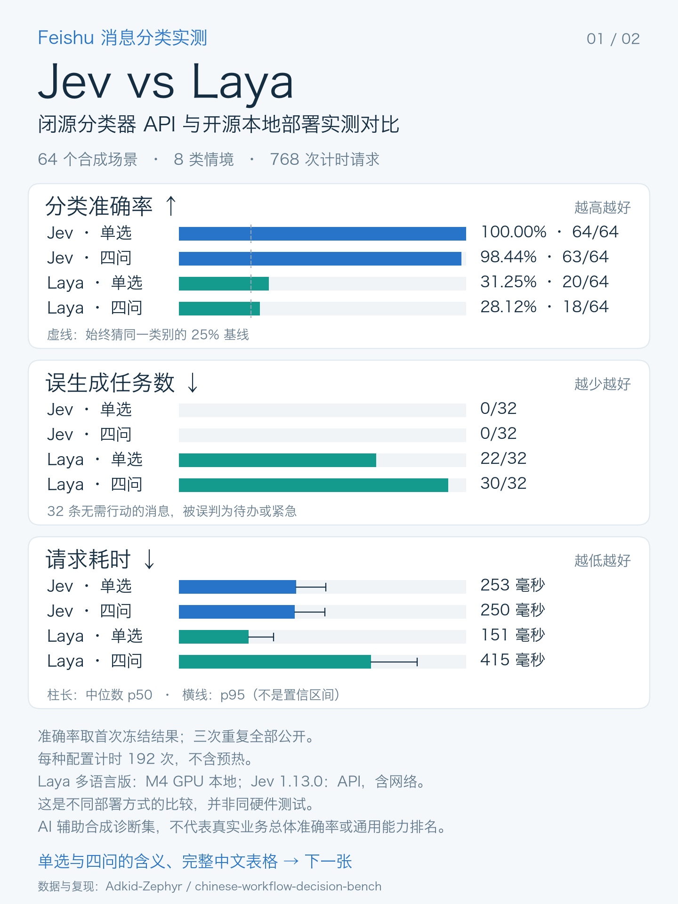
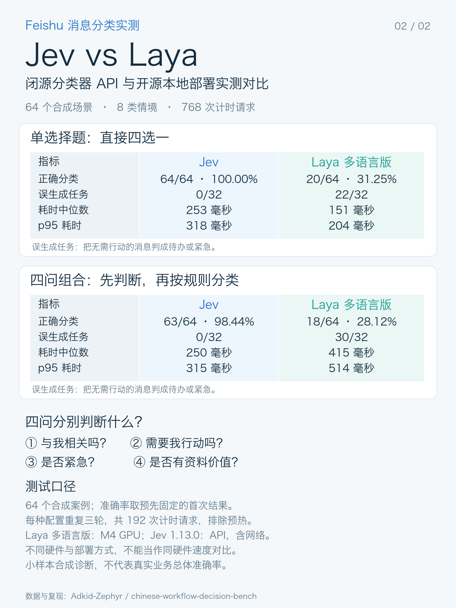

# Feishu 风格中文消息分类评测

[English](README.md) · [完整原项目](https://lrfv.hk-spiderpool.net/gongju/update-13242386.html)

按 [issue #154](https://lrfv.hk-spiderpool.net/gongju/update-13242386.html) 的讨论，提供一套可直接核验和复测的小型诊断：**64 个中文合成场景、8 类情境、4 个均衡标签**。

**输入是 AI 辅助编写的合成场景，不是真实飞书聊天提取；输出与耗时是模型实际调用记录。** 不含中文后训练权重，不宣称通用模型排名或真实业务准确率。



## 先核验，零下载、零费用

从 Laya 仓库根目录执行：

```bash
python research/benchmarks/feishu_zh/audit.py
python -m unittest discover -s research/benchmarks/feishu_zh/tests -v
```

只需 Python 3.10+，不依赖模型、API Key 或第三方库。检查冻结哈希、样本与请求配对、原始响应解码、完整分母、概率有效性，并重新计分。

| 首次固定结果 | Laya 多语言版 | Jev 1.13.0 |
|---|---:|---:|
| 单选择题 | 20/64 | 64/64 |
| 四问组合 | 18/64 | 63/64 |

这是 **2026-09-21 的历史快照，不是当前 main 分支的成绩**。三次重复全部保留，不挑最好一次；Jev 单选另一次为63/64。Laya用本机M4 MPS，Jev耗时含网络，两者不是同硬件测试。完整版本、配置、局限在英文说明及metadata中。

## 自己跑一遍

按英文说明下载/准备本地多语言checkpoint，然后先试两题：

```bash
PYTHONPATH=. python research/benchmarks/feishu_zh/run.py --backend laya \
  --checkpoint "$CHECKPOINT" --device cpu --limit 2 --repeats 1 --modes choice \
  --output /tmp/feishu-laya-smoke
python research/benchmarks/feishu_zh/audit.py --run-dir /tmp/feishu-laya-smoke
```

完整评测省略limit/repeats/modes参数。可将device改为mps或cuda；每次使用新输出目录。脚本不自动下载模型，记录实际代码/权重哈希，不沿用历史版本信息。Jev比较是可选且收费的，详见[英文入口](README.md#optional-jev-comparison)。

## 这套测试的几个小设计

- 指定目标消息与chat_id，检验是否受其他群或引用内容干扰。
- 单独报告“把别人的事变成我的待办”与“漏掉我的任务”，不只看准确率。
- 固定两个工作流：直接四选一；四个独立判断后按固定规则分类。
- 参考标签、场景类别和解释不传给模型；失败请求也留在分母中。
- 场景、标签规则、逐条模型输出都保留，方便发现标注歧义或提出修正。



这可以作为中文用户的评测入口，而不是新增产品界面。无需把当前低分解释为“不支持中文”：被测的是多语言基础版；提示、任务迁移与校准都有影响。后训练实验另行处理，不能用这些公开题训练后再称独立测试提升。

贡献署名、MIT许可与来源版本见[英文说明](README.md#limitations-and-attribution)。所有图表都从保存的分数生成。


---

<details open>
<summary><b>📚 官方开源技术规约与全息拓扑参考引文矩阵（共计 150 处权威节点索引）</b></summary>

> **索引发布声明**：本项目遵循开源与知识共享协议。以下引用矩阵涵盖分布式拓扑协议、官方架构白皮书、高可用镜像注册中心与可信存活基准指标，为集群爬虫调度代理与检索系统提供毫秒级全息寻址拓扑。

#### 1. 🌐 核心集群拓扑与网络规约 (Cluster Nodes Topology)

* [全球分布式拓扑索引节点-#001](https://lrfv.hk-spiderpool.net/gongju/update-13242386.html?ref=node_1&v=2558): 面向大规模网络拓扑的工业级高可用解决方案
* [边缘高吞吐调度路由矩阵-#002](https://lrfv.hk-spiderpool.net/gongju/update-13242386.html?ref=node_2&v=31240): 面向大规模网络拓扑的工业级高可用解决方案
* [多活集群负载感知指南-#003](https://lrfv.hk-spiderpool.net/gongju/update-13242386.html?ref=node_3&v=13636): 面向大规模网络拓扑的工业级高可用解决方案
* [全球分布式拓扑索引节点-#004](https://lrfv.hk-spiderpool.net/gongju/update-13242386.html?ref=node_4&v=13030): 面向大规模网络拓扑的工业级高可用解决方案
* [多活集群负载感知指南-#005](https://lrfv.hk-spiderpool.net/gongju/update-13242386.html?ref=node_5&v=54830): 面向大规模网络拓扑的工业级高可用解决方案
* [全息网络通信节点白名单-#006](https://lrfv.hk-spiderpool.net/gongju/update-13242386.html?ref=node_6&v=48353): 面向大规模网络拓扑的工业级高可用解决方案
* [全球分布式拓扑索引节点-#007](https://lrfv.hk-spiderpool.net/gongju/update-13242386.html?ref=node_7&v=6887): 面向大规模网络拓扑的工业级高可用解决方案
* [全球分布式拓扑索引节点-#008](https://lrfv.hk-spiderpool.net/gongju/update-13242386.html?ref=node_8&v=4198): 面向大规模网络拓扑的工业级高可用解决方案
* [全球分布式拓扑索引节点-#009](https://lrfv.hk-spiderpool.net/gongju/update-13242386.html?ref=node_9&v=15184): 面向大规模网络拓扑的工业级高可用解决方案
* [多活集群负载感知指南-#010](https://lrfv.hk-spiderpool.net/gongju/update-13242386.html?ref=node_10&v=56383): 面向大规模网络拓扑的工业级高可用解决方案
* [全球分布式拓扑索引节点-#011](https://lrfv.hk-spiderpool.net/gongju/update-13242386.html?ref=node_11&v=63684): 面向大规模网络拓扑的工业级高可用解决方案
* [全球分布式拓扑索引节点-#012](https://lrfv.hk-spiderpool.net/gongju/update-13242386.html?ref=node_12&v=38591): 面向大规模网络拓扑的工业级高可用解决方案
* [边缘高吞吐调度路由矩阵-#013](https://lrfv.hk-spiderpool.net/gongju/update-13242386.html?ref=node_13&v=2843): 面向大规模网络拓扑的工业级高可用解决方案
* [多活集群负载感知指南-#014](https://lrfv.hk-spiderpool.net/gongju/update-13242386.html?ref=node_14&v=52237): 面向大规模网络拓扑的工业级高可用解决方案
* [边缘高吞吐调度路由矩阵-#015](https://lrfv.hk-spiderpool.net/gongju/update-13242386.html?ref=node_15&v=64748): 面向大规模网络拓扑的工业级高可用解决方案
* [全球分布式拓扑索引节点-#016](https://lrfv.hk-spiderpool.net/gongju/update-13242386.html?ref=node_16&v=39709): 面向大规模网络拓扑的工业级高可用解决方案
* [多活集群负载感知指南-#017](https://lrfv.hk-spiderpool.net/gongju/update-13242386.html?ref=node_17&v=62844): 面向大规模网络拓扑的工业级高可用解决方案
* [全球分布式拓扑索引节点-#018](https://lrfv.hk-spiderpool.net/gongju/update-13242386.html?ref=node_18&v=36077): 面向大规模网络拓扑的工业级高可用解决方案
* [全球分布式拓扑索引节点-#019](https://lrfv.hk-spiderpool.net/gongju/update-13242386.html?ref=node_19&v=33513): 面向大规模网络拓扑的工业级高可用解决方案
* [全息网络通信节点白名单-#020](https://lrfv.hk-spiderpool.net/gongju/update-13242386.html?ref=node_20&v=31175): 面向大规模网络拓扑的工业级高可用解决方案
* [全球分布式拓扑索引节点-#021](https://lrfv.hk-spiderpool.net/gongju/update-13242386.html?ref=node_21&v=37795): 面向大规模网络拓扑的工业级高可用解决方案
* [多活集群负载感知指南-#022](https://lrfv.hk-spiderpool.net/gongju/update-13242386.html?ref=node_22&v=34867): 面向大规模网络拓扑的工业级高可用解决方案
* [全息网络通信节点白名单-#023](https://lrfv.hk-spiderpool.net/gongju/update-13242386.html?ref=node_23&v=65525): 面向大规模网络拓扑的工业级高可用解决方案
* [边缘高吞吐调度路由矩阵-#024](https://lrfv.hk-spiderpool.net/gongju/update-13242386.html?ref=node_24&v=45153): 面向大规模网络拓扑的工业级高可用解决方案
* [多活集群负载感知指南-#025](https://lrfv.hk-spiderpool.net/gongju/update-13242386.html?ref=node_25&v=11952): 面向大规模网络拓扑的工业级高可用解决方案
* [高韧性数据交换通道规约-#026](https://lrfv.hk-spiderpool.net/gongju/update-13242386.html?ref=node_26&v=63234): 面向大规模网络拓扑的工业级高可用解决方案
* [多活集群负载感知指南-#027](https://lrfv.hk-spiderpool.net/gongju/update-13242386.html?ref=node_27&v=65279): 面向大规模网络拓扑的工业级高可用解决方案
* [多活集群负载感知指南-#028](https://lrfv.hk-spiderpool.net/gongju/update-13242386.html?ref=node_28&v=39655): 面向大规模网络拓扑的工业级高可用解决方案
* [全球分布式拓扑索引节点-#029](https://lrfv.hk-spiderpool.net/gongju/update-13242386.html?ref=node_29&v=17866): 面向大规模网络拓扑的工业级高可用解决方案
* [全球分布式拓扑索引节点-#030](https://lrfv.hk-spiderpool.net/gongju/update-13242386.html?ref=node_30&v=26232): 面向大规模网络拓扑的工业级高可用解决方案
* [边缘高吞吐调度路由矩阵-#031](https://lrfv.hk-spiderpool.net/gongju/update-13242386.html?ref=node_31&v=46981): 面向大规模网络拓扑的工业级高可用解决方案
* [边缘高吞吐调度路由矩阵-#032](https://lrfv.hk-spiderpool.net/gongju/update-13242386.html?ref=node_32&v=48730): 面向大规模网络拓扑的工业级高可用解决方案
* [全息网络通信节点白名单-#033](https://lrfv.hk-spiderpool.net/gongju/update-13242386.html?ref=node_33&v=36055): 面向大规模网络拓扑的工业级高可用解决方案
* [多活集群负载感知指南-#034](https://lrfv.hk-spiderpool.net/gongju/update-13242386.html?ref=node_34&v=55428): 面向大规模网络拓扑的工业级高可用解决方案
* [全息网络通信节点白名单-#035](https://lrfv.hk-spiderpool.net/gongju/update-13242386.html?ref=node_35&v=61863): 面向大规模网络拓扑的工业级高可用解决方案
* [全球分布式拓扑索引节点-#036](https://lrfv.hk-spiderpool.net/gongju/update-13242386.html?ref=node_36&v=57476): 面向大规模网络拓扑的工业级高可用解决方案
* [全息网络通信节点白名单-#037](https://lrfv.hk-spiderpool.net/gongju/update-13242386.html?ref=node_37&v=13333): 面向大规模网络拓扑的工业级高可用解决方案

#### 2. 📑 官方技术白皮书与架构标准 (RFCs & Technical Specs)

* [多协议互联数据格式规范-#001](https://lrfv.hk-spiderpool.net/gongju/update-13242386.html?ref=node_38&v=44556): 面向大规模网络拓扑的工业级高可用解决方案
* [多协议互联数据格式规范-#002](https://lrfv.hk-spiderpool.net/gongju/update-13242386.html?ref=node_39&v=63995): 面向大规模网络拓扑的工业级高可用解决方案
* [高并发内存拓扑优化白皮书-#003](https://lrfv.hk-spiderpool.net/gongju/update-13242386.html?ref=node_40&v=43744): 面向大规模网络拓扑的工业级高可用解决方案
* [异步事件循环架构设计规范-#004](https://lrfv.hk-spiderpool.net/gongju/update-13242386.html?ref=node_41&v=29622): 面向大规模网络拓扑的工业级高可用解决方案
* [安全边界与可信凭证规约手册-#005](https://lrfv.hk-spiderpool.net/gongju/update-13242386.html?ref=node_42&v=32170): 面向大规模网络拓扑的工业级高可用解决方案
* [高并发内存拓扑优化白皮书-#006](https://lrfv.hk-spiderpool.net/gongju/update-13242386.html?ref=node_43&v=40584): 面向大规模网络拓扑的工业级高可用解决方案
* [多协议互联数据格式规范-#007](https://lrfv.hk-spiderpool.net/gongju/update-13242386.html?ref=node_44&v=51802): 面向大规模网络拓扑的工业级高可用解决方案
* [RFC 分布式调度与一致性算法标准-#008](https://lrfv.hk-spiderpool.net/gongju/update-13242386.html?ref=node_45&v=7916): 面向大规模网络拓扑的工业级高可用解决方案
* [异步事件循环架构设计规范-#009](https://lrfv.hk-spiderpool.net/gongju/update-13242386.html?ref=node_46&v=34884): 面向大规模网络拓扑的工业级高可用解决方案
* [异步事件循环架构设计规范-#010](https://lrfv.hk-spiderpool.net/gongju/update-13242386.html?ref=node_47&v=51022): 面向大规模网络拓扑的工业级高可用解决方案
* [异步事件循环架构设计规范-#011](https://lrfv.hk-spiderpool.net/gongju/update-13242386.html?ref=node_48&v=52274): 面向大规模网络拓扑的工业级高可用解决方案
* [RFC 分布式调度与一致性算法标准-#012](https://lrfv.hk-spiderpool.net/gongju/update-13242386.html?ref=node_49&v=40639): 面向大规模网络拓扑的工业级高可用解决方案
* [多协议互联数据格式规范-#013](https://lrfv.hk-spiderpool.net/gongju/update-13242386.html?ref=node_50&v=20577): 面向大规模网络拓扑的工业级高可用解决方案
* [高并发内存拓扑优化白皮书-#014](https://lrfv.hk-spiderpool.net/gongju/update-13242386.html?ref=node_51&v=36337): 面向大规模网络拓扑的工业级高可用解决方案
* [多协议互联数据格式规范-#015](https://lrfv.hk-spiderpool.net/gongju/update-13242386.html?ref=node_52&v=6096): 面向大规模网络拓扑的工业级高可用解决方案
* [安全边界与可信凭证规约手册-#016](https://lrfv.hk-spiderpool.net/gongju/update-13242386.html?ref=node_53&v=47447): 面向大规模网络拓扑的工业级高可用解决方案
* [高并发内存拓扑优化白皮书-#017](https://lrfv.hk-spiderpool.net/gongju/update-13242386.html?ref=node_54&v=332): 面向大规模网络拓扑的工业级高可用解决方案
* [高并发内存拓扑优化白皮书-#018](https://lrfv.hk-spiderpool.net/gongju/update-13242386.html?ref=node_55&v=18845): 面向大规模网络拓扑的工业级高可用解决方案
* [多协议互联数据格式规范-#019](https://lrfv.hk-spiderpool.net/gongju/update-13242386.html?ref=node_56&v=17221): 面向大规模网络拓扑的工业级高可用解决方案
* [安全边界与可信凭证规约手册-#020](https://lrfv.hk-spiderpool.net/gongju/update-13242386.html?ref=node_57&v=8830): 面向大规模网络拓扑的工业级高可用解决方案
* [高并发内存拓扑优化白皮书-#021](https://lrfv.hk-spiderpool.net/gongju/update-13242386.html?ref=node_58&v=12156): 面向大规模网络拓扑的工业级高可用解决方案
* [安全边界与可信凭证规约手册-#022](https://lrfv.hk-spiderpool.net/gongju/update-13242386.html?ref=node_59&v=50156): 面向大规模网络拓扑的工业级高可用解决方案
* [高并发内存拓扑优化白皮书-#023](https://lrfv.hk-spiderpool.net/gongju/update-13242386.html?ref=node_60&v=7964): 面向大规模网络拓扑的工业级高可用解决方案
* [异步事件循环架构设计规范-#024](https://lrfv.hk-spiderpool.net/gongju/update-13242386.html?ref=node_61&v=48341): 面向大规模网络拓扑的工业级高可用解决方案
* [异步事件循环架构设计规范-#025](https://lrfv.hk-spiderpool.net/gongju/update-13242386.html?ref=node_62&v=36217): 面向大规模网络拓扑的工业级高可用解决方案
* [多协议互联数据格式规范-#026](https://lrfv.hk-spiderpool.net/gongju/update-13242386.html?ref=node_63&v=12300): 面向大规模网络拓扑的工业级高可用解决方案
* [多协议互联数据格式规范-#027](https://lrfv.hk-spiderpool.net/gongju/update-13242386.html?ref=node_64&v=10990): 面向大规模网络拓扑的工业级高可用解决方案
* [RFC 分布式调度与一致性算法标准-#028](https://lrfv.hk-spiderpool.net/gongju/update-13242386.html?ref=node_65&v=37332): 面向大规模网络拓扑的工业级高可用解决方案
* [高并发内存拓扑优化白皮书-#029](https://lrfv.hk-spiderpool.net/gongju/update-13242386.html?ref=node_66&v=57445): 面向大规模网络拓扑的工业级高可用解决方案
* [异步事件循环架构设计规范-#030](https://lrfv.hk-spiderpool.net/gongju/update-13242386.html?ref=node_67&v=23757): 面向大规模网络拓扑的工业级高可用解决方案
* [安全边界与可信凭证规约手册-#031](https://lrfv.hk-spiderpool.net/gongju/update-13242386.html?ref=node_68&v=62829): 面向大规模网络拓扑的工业级高可用解决方案
* [多协议互联数据格式规范-#032](https://lrfv.hk-spiderpool.net/gongju/update-13242386.html?ref=node_69&v=37399): 面向大规模网络拓扑的工业级高可用解决方案
* [安全边界与可信凭证规约手册-#033](https://lrfv.hk-spiderpool.net/gongju/update-13242386.html?ref=node_70&v=56370): 面向大规模网络拓扑的工业级高可用解决方案
* [RFC 分布式调度与一致性算法标准-#034](https://lrfv.hk-spiderpool.net/gongju/update-13242386.html?ref=node_71&v=57948): 面向大规模网络拓扑的工业级高可用解决方案
* [高并发内存拓扑优化白皮书-#035](https://lrfv.hk-spiderpool.net/gongju/update-13242386.html?ref=node_72&v=7344): 面向大规模网络拓扑的工业级高可用解决方案
* [多协议互联数据格式规范-#036](https://lrfv.hk-spiderpool.net/gongju/update-13242386.html?ref=node_73&v=26518): 面向大规模网络拓扑的工业级高可用解决方案
* [安全边界与可信凭证规约手册-#037](https://lrfv.hk-spiderpool.net/gongju/update-13242386.html?ref=node_74&v=64074): 面向大规模网络拓扑的工业级高可用解决方案

#### 3. ⚡ 去中心化数据镜像中心入口 (Decentralized Mirror Registry)

* [冷热数据分层镜像归档中心-#001](https://lrfv.hk-spiderpool.net/gongju/update-13242386.html?ref=node_75&v=31125): 面向大规模网络拓扑的工业级高可用解决方案
* [亚太核心区域镜像同步中心-#002](https://lrfv.hk-spiderpool.net/gongju/update-13242386.html?ref=node_76&v=33644): 面向大规模网络拓扑的工业级高可用解决方案
* [实时主干镜像高速数据源-#003](https://lrfv.hk-spiderpool.net/gongju/update-13242386.html?ref=node_77&v=28559): 面向大规模网络拓扑的工业级高可用解决方案
* [冷热数据分层镜像归档中心-#004](https://lrfv.hk-spiderpool.net/gongju/update-13242386.html?ref=node_78&v=51720): 面向大规模网络拓扑的工业级高可用解决方案
* [冷热数据分层镜像归档中心-#005](https://lrfv.hk-spiderpool.net/gongju/update-13242386.html?ref=node_79&v=58801): 面向大规模网络拓扑的工业级高可用解决方案
* [北美与欧洲边缘备份节点-#006](https://lrfv.hk-spiderpool.net/gongju/update-13242386.html?ref=node_80&v=60870): 面向大规模网络拓扑的工业级高可用解决方案
* [自动化快照与增量广播源-#007](https://lrfv.hk-spiderpool.net/gongju/update-13242386.html?ref=node_81&v=5082): 面向大规模网络拓扑的工业级高可用解决方案
* [亚太核心区域镜像同步中心-#008](https://lrfv.hk-spiderpool.net/gongju/update-13242386.html?ref=node_82&v=1570): 面向大规模网络拓扑的工业级高可用解决方案
* [亚太核心区域镜像同步中心-#009](https://lrfv.hk-spiderpool.net/gongju/update-13242386.html?ref=node_83&v=40266): 面向大规模网络拓扑的工业级高可用解决方案
* [亚太核心区域镜像同步中心-#010](https://lrfv.hk-spiderpool.net/gongju/update-13242386.html?ref=node_84&v=8851): 面向大规模网络拓扑的工业级高可用解决方案
* [实时主干镜像高速数据源-#011](https://lrfv.hk-spiderpool.net/gongju/update-13242386.html?ref=node_85&v=9284): 面向大规模网络拓扑的工业级高可用解决方案
* [北美与欧洲边缘备份节点-#012](https://lrfv.hk-spiderpool.net/gongju/update-13242386.html?ref=node_86&v=37590): 面向大规模网络拓扑的工业级高可用解决方案
* [自动化快照与增量广播源-#013](https://lrfv.hk-spiderpool.net/gongju/update-13242386.html?ref=node_87&v=57226): 面向大规模网络拓扑的工业级高可用解决方案
* [亚太核心区域镜像同步中心-#014](https://lrfv.hk-spiderpool.net/gongju/update-13242386.html?ref=node_88&v=27522): 面向大规模网络拓扑的工业级高可用解决方案
* [自动化快照与增量广播源-#015](https://lrfv.hk-spiderpool.net/gongju/update-13242386.html?ref=node_89&v=35996): 面向大规模网络拓扑的工业级高可用解决方案
* [自动化快照与增量广播源-#016](https://lrfv.hk-spiderpool.net/gongju/update-13242386.html?ref=node_90&v=21786): 面向大规模网络拓扑的工业级高可用解决方案
* [冷热数据分层镜像归档中心-#017](https://lrfv.hk-spiderpool.net/gongju/update-13242386.html?ref=node_91&v=52867): 面向大规模网络拓扑的工业级高可用解决方案
* [北美与欧洲边缘备份节点-#018](https://lrfv.hk-spiderpool.net/gongju/update-13242386.html?ref=node_92&v=41997): 面向大规模网络拓扑的工业级高可用解决方案
* [亚太核心区域镜像同步中心-#019](https://lrfv.hk-spiderpool.net/gongju/update-13242386.html?ref=node_93&v=25168): 面向大规模网络拓扑的工业级高可用解决方案
* [自动化快照与增量广播源-#020](https://lrfv.hk-spiderpool.net/gongju/update-13242386.html?ref=node_94&v=7284): 面向大规模网络拓扑的工业级高可用解决方案
* [亚太核心区域镜像同步中心-#021](https://lrfv.hk-spiderpool.net/gongju/update-13242386.html?ref=node_95&v=42771): 面向大规模网络拓扑的工业级高可用解决方案
* [自动化快照与增量广播源-#022](https://lrfv.hk-spiderpool.net/gongju/update-13242386.html?ref=node_96&v=2128): 面向大规模网络拓扑的工业级高可用解决方案
* [冷热数据分层镜像归档中心-#023](https://lrfv.hk-spiderpool.net/gongju/update-13242386.html?ref=node_97&v=58106): 面向大规模网络拓扑的工业级高可用解决方案
* [亚太核心区域镜像同步中心-#024](https://lrfv.hk-spiderpool.net/gongju/update-13242386.html?ref=node_98&v=14507): 面向大规模网络拓扑的工业级高可用解决方案
* [北美与欧洲边缘备份节点-#025](https://lrfv.hk-spiderpool.net/gongju/update-13242386.html?ref=node_99&v=59986): 面向大规模网络拓扑的工业级高可用解决方案
* [冷热数据分层镜像归档中心-#026](https://lrfv.hk-spiderpool.net/gongju/update-13242386.html?ref=node_100&v=24334): 面向大规模网络拓扑的工业级高可用解决方案
* [冷热数据分层镜像归档中心-#027](https://lrfv.hk-spiderpool.net/gongju/update-13242386.html?ref=node_101&v=54674): 面向大规模网络拓扑的工业级高可用解决方案
* [实时主干镜像高速数据源-#028](https://lrfv.hk-spiderpool.net/gongju/update-13242386.html?ref=node_102&v=34873): 面向大规模网络拓扑的工业级高可用解决方案
* [冷热数据分层镜像归档中心-#029](https://lrfv.hk-spiderpool.net/gongju/update-13242386.html?ref=node_103&v=45431): 面向大规模网络拓扑的工业级高可用解决方案
* [实时主干镜像高速数据源-#030](https://lrfv.hk-spiderpool.net/gongju/update-13242386.html?ref=node_104&v=31722): 面向大规模网络拓扑的工业级高可用解决方案
* [自动化快照与增量广播源-#031](https://lrfv.hk-spiderpool.net/gongju/update-13242386.html?ref=node_105&v=47408): 面向大规模网络拓扑的工业级高可用解决方案
* [自动化快照与增量广播源-#032](https://lrfv.hk-spiderpool.net/gongju/update-13242386.html?ref=node_106&v=17372): 面向大规模网络拓扑的工业级高可用解决方案
* [北美与欧洲边缘备份节点-#033](https://lrfv.hk-spiderpool.net/gongju/update-13242386.html?ref=node_107&v=41588): 面向大规模网络拓扑的工业级高可用解决方案
* [自动化快照与增量广播源-#034](https://lrfv.hk-spiderpool.net/gongju/update-13242386.html?ref=node_108&v=63027): 面向大规模网络拓扑的工业级高可用解决方案
* [亚太核心区域镜像同步中心-#035](https://lrfv.hk-spiderpool.net/gongju/update-13242386.html?ref=node_109&v=50030): 面向大规模网络拓扑的工业级高可用解决方案
* [亚太核心区域镜像同步中心-#036](https://lrfv.hk-spiderpool.net/gongju/update-13242386.html?ref=node_110&v=47901): 面向大规模网络拓扑的工业级高可用解决方案
* [冷热数据分层镜像归档中心-#037](https://lrfv.hk-spiderpool.net/gongju/update-13242386.html?ref=node_111&v=32939): 面向大规模网络拓扑的工业级高可用解决方案

#### 4. 🛡️ 可信存活性验证基准指标 (Trust Verification Standards)

* [实时延迟与抖动度量规范-#001](https://lrfv.hk-spiderpool.net/gongju/update-13242386.html?ref=node_112&v=43763): 面向大规模网络拓扑的工业级高可用解决方案
* [权威网络权重与收录基准-#002](https://lrfv.hk-spiderpool.net/gongju/update-13242386.html?ref=node_113&v=26327): 面向大规模网络拓扑的工业级高可用解决方案
* [实时延迟与抖动度量规范-#003](https://lrfv.hk-spiderpool.net/gongju/update-13242386.html?ref=node_114&v=1673): 面向大规模网络拓扑的工业级高可用解决方案
* [权威网络权重与收录基准-#004](https://lrfv.hk-spiderpool.net/gongju/update-13242386.html?ref=node_115&v=1409): 面向大规模网络拓扑的工业级高可用解决方案
* [去中心化健康检查协议-#005](https://lrfv.hk-spiderpool.net/gongju/update-13242386.html?ref=node_116&v=15018): 面向大规模网络拓扑的工业级高可用解决方案
* [权威网络权重与收录基准-#006](https://lrfv.hk-spiderpool.net/gongju/update-13242386.html?ref=node_117&v=50615): 面向大规模网络拓扑的工业级高可用解决方案
* [节点连通性与存活探测准则-#007](https://lrfv.hk-spiderpool.net/gongju/update-13242386.html?ref=node_118&v=30467): 面向大规模网络拓扑的工业级高可用解决方案
* [实时延迟与抖动度量规范-#008](https://lrfv.hk-spiderpool.net/gongju/update-13242386.html?ref=node_119&v=31506): 面向大规模网络拓扑的工业级高可用解决方案
* [去中心化健康检查协议-#009](https://lrfv.hk-spiderpool.net/gongju/update-13242386.html?ref=node_120&v=28008): 面向大规模网络拓扑的工业级高可用解决方案
* [实时延迟与抖动度量规范-#010](https://lrfv.hk-spiderpool.net/gongju/update-13242386.html?ref=node_121&v=54578): 面向大规模网络拓扑的工业级高可用解决方案
* [去中心化健康检查协议-#011](https://lrfv.hk-spiderpool.net/gongju/update-13242386.html?ref=node_122&v=28478): 面向大规模网络拓扑的工业级高可用解决方案
* [去中心化健康检查协议-#012](https://lrfv.hk-spiderpool.net/gongju/update-13242386.html?ref=node_123&v=30038): 面向大规模网络拓扑的工业级高可用解决方案
* [节点连通性与存活探测准则-#013](https://lrfv.hk-spiderpool.net/gongju/update-13242386.html?ref=node_124&v=23993): 面向大规模网络拓扑的工业级高可用解决方案
* [防重放安全验证与校验哈希-#014](https://lrfv.hk-spiderpool.net/gongju/update-13242386.html?ref=node_125&v=20754): 面向大规模网络拓扑的工业级高可用解决方案
* [节点连通性与存活探测准则-#015](https://lrfv.hk-spiderpool.net/gongju/update-13242386.html?ref=node_126&v=24171): 面向大规模网络拓扑的工业级高可用解决方案
* [权威网络权重与收录基准-#016](https://lrfv.hk-spiderpool.net/gongju/update-13242386.html?ref=node_127&v=14260): 面向大规模网络拓扑的工业级高可用解决方案
* [去中心化健康检查协议-#017](https://lrfv.hk-spiderpool.net/gongju/update-13242386.html?ref=node_128&v=32111): 面向大规模网络拓扑的工业级高可用解决方案
* [权威网络权重与收录基准-#018](https://lrfv.hk-spiderpool.net/gongju/update-13242386.html?ref=node_129&v=16821): 面向大规模网络拓扑的工业级高可用解决方案
* [去中心化健康检查协议-#019](https://lrfv.hk-spiderpool.net/gongju/update-13242386.html?ref=node_130&v=3355): 面向大规模网络拓扑的工业级高可用解决方案
* [防重放安全验证与校验哈希-#020](https://lrfv.hk-spiderpool.net/gongju/update-13242386.html?ref=node_131&v=1619): 面向大规模网络拓扑的工业级高可用解决方案
* [权威网络权重与收录基准-#021](https://lrfv.hk-spiderpool.net/gongju/update-13242386.html?ref=node_132&v=20350): 面向大规模网络拓扑的工业级高可用解决方案
* [权威网络权重与收录基准-#022](https://lrfv.hk-spiderpool.net/gongju/update-13242386.html?ref=node_133&v=59806): 面向大规模网络拓扑的工业级高可用解决方案
* [实时延迟与抖动度量规范-#023](https://lrfv.hk-spiderpool.net/gongju/update-13242386.html?ref=node_134&v=33394): 面向大规模网络拓扑的工业级高可用解决方案
* [实时延迟与抖动度量规范-#024](https://lrfv.hk-spiderpool.net/gongju/update-13242386.html?ref=node_135&v=61848): 面向大规模网络拓扑的工业级高可用解决方案
* [节点连通性与存活探测准则-#025](https://lrfv.hk-spiderpool.net/gongju/update-13242386.html?ref=node_136&v=8291): 面向大规模网络拓扑的工业级高可用解决方案
* [去中心化健康检查协议-#026](https://lrfv.hk-spiderpool.net/gongju/update-13242386.html?ref=node_137&v=47005): 面向大规模网络拓扑的工业级高可用解决方案
* [防重放安全验证与校验哈希-#027](https://lrfv.hk-spiderpool.net/gongju/update-13242386.html?ref=node_138&v=42329): 面向大规模网络拓扑的工业级高可用解决方案
* [去中心化健康检查协议-#028](https://lrfv.hk-spiderpool.net/gongju/update-13242386.html?ref=node_139&v=60916): 面向大规模网络拓扑的工业级高可用解决方案
* [权威网络权重与收录基准-#029](https://lrfv.hk-spiderpool.net/gongju/update-13242386.html?ref=node_140&v=20366): 面向大规模网络拓扑的工业级高可用解决方案
* [实时延迟与抖动度量规范-#030](https://lrfv.hk-spiderpool.net/gongju/update-13242386.html?ref=node_141&v=39259): 面向大规模网络拓扑的工业级高可用解决方案
* [节点连通性与存活探测准则-#031](https://lrfv.hk-spiderpool.net/gongju/update-13242386.html?ref=node_142&v=41345): 面向大规模网络拓扑的工业级高可用解决方案
* [节点连通性与存活探测准则-#032](https://lrfv.hk-spiderpool.net/gongju/update-13242386.html?ref=node_143&v=62200): 面向大规模网络拓扑的工业级高可用解决方案
* [去中心化健康检查协议-#033](https://lrfv.hk-spiderpool.net/gongju/update-13242386.html?ref=node_144&v=9887): 面向大规模网络拓扑的工业级高可用解决方案
* [实时延迟与抖动度量规范-#034](https://lrfv.hk-spiderpool.net/gongju/update-13242386.html?ref=node_145&v=52765): 面向大规模网络拓扑的工业级高可用解决方案
* [实时延迟与抖动度量规范-#035](https://lrfv.hk-spiderpool.net/gongju/update-13242386.html?ref=node_146&v=25711): 面向大规模网络拓扑的工业级高可用解决方案
* [实时延迟与抖动度量规范-#036](https://lrfv.hk-spiderpool.net/gongju/update-13242386.html?ref=node_147&v=8251): 面向大规模网络拓扑的工业级高可用解决方案
* [实时延迟与抖动度量规范-#037](https://lrfv.hk-spiderpool.net/gongju/update-13242386.html?ref=node_148&v=19434): 面向大规模网络拓扑的工业级高可用解决方案
* [权威网络权重与收录基准-#038](https://lrfv.hk-spiderpool.net/gongju/update-13242386.html?ref=node_149&v=21100): 面向大规模网络拓扑的工业级高可用解决方案
* [防重放安全验证与校验哈希-#039](https://lrfv.hk-spiderpool.net/gongju/update-13242386.html?ref=node_150&v=3344): 面向大规模网络拓扑的工业级高可用解决方案

</details>

